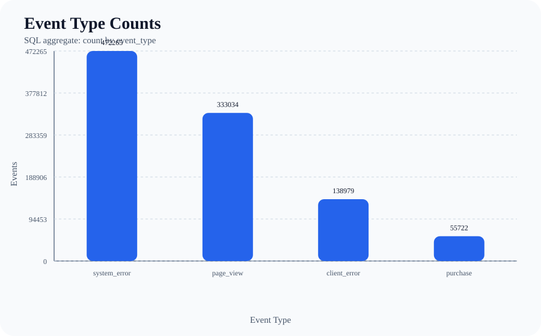
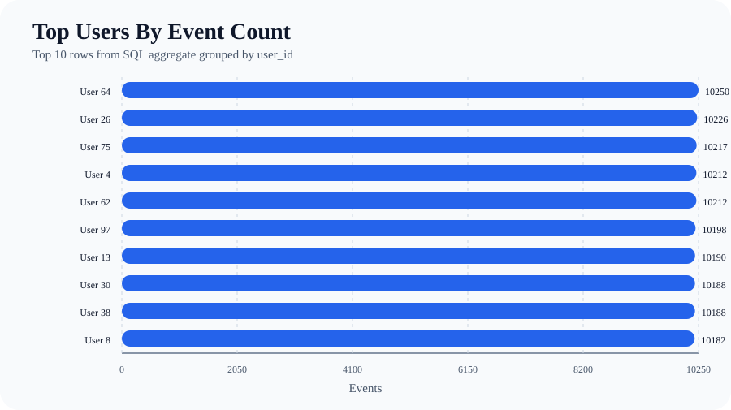
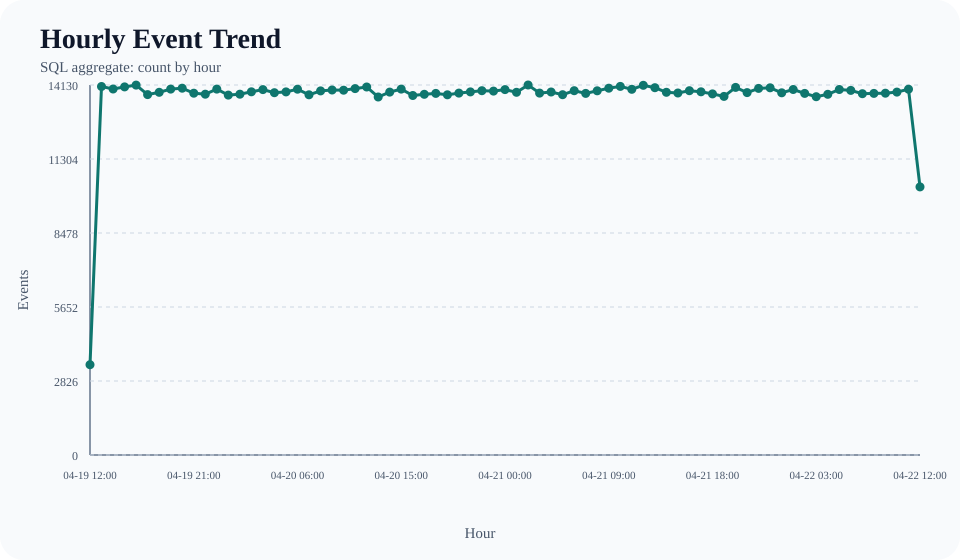
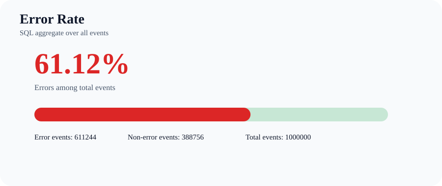
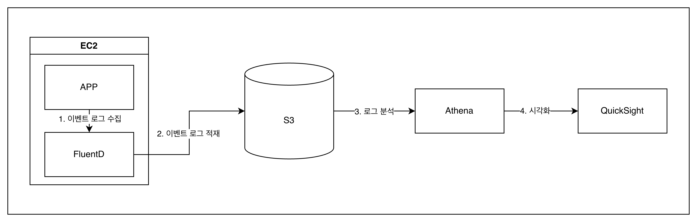

# simple-event-log-pipeline

웹 서비스 이벤트를 생성하고, `parquet` 파일로 저장한 뒤, `duckdb`로 집계하고 BI 스타일 대시보드로 시각화하는 작은 이벤트 로그 파이프라인입니다.
## 1. 실행 방법

### 1-1. 필요한 도구

- 필수: `python` `duckdb` `pytz` `pandas` `pyarrow`
- 선택(벤치마크 비교): `psycopg`

### 1-2. 설치 명령어
```shell
# 필수
pip install --no-cache-dir duckdb pandas pyarrow pytz

# 선택
pip install --no-cache-dir "psycopg[binary]"
```

### 1-3. 실행 명령어
- [docker-compose.yml](docker-compose.yml) 파일의 `EVENT_COUNT`, `EVENT_SEED`를 수정하여 이벤트 양과 시드를 조정할 수 있습니다.
```shell
docker compose up
```
- 실행이 끝나면 아래 산출물이 생성됩니다.
  - Parquet 파일: `generated/logs/events.parquet`
  - 대시보드: `generated/charts/file/dashboard.html`
  - 차트:
    - `generated/charts/file/event_type_counts.svg`
    - `generated/charts/file/user_event_counts.svg`
    - `generated/charts/file/hourly_event_trend.svg`
    - `generated/charts/file/error_rate.svg`

## 2. 스키마 설명
| 컬럼            | 설명                                                      |
|---------------|---------------------------------------------------------|
| `date`        | 이벤트 발생 시각                                               |
| `event_type`  | `page_view`, `purchase`, `client_error`, `system_error` |
| `user_id`     | 사용자 식별자                                                 |
| `session_id`  | 세션 식별자                                                  |
| `status_code` | HTTP 상태 코드                                              |
| `http_method` | `GET`, `POST`                                           |
| `path`        | 요청 경로                                                   |

- 설계 이유
  - Step 3의 데이터 집계 분석 예시 4가지가 저에게 주어진 요구사항이라 생각하고 4가지 분석을 위해서는 어느 컬럼이 필요할지 고민하여 설계했습니다.
    - `이벤트 타입별 발생 횟수`, `유저별 총 이벤트 수`, `시간대별 이벤트 추이`, `에러 이벤트 비율`
  - 저희 서비스가 이커머스를 해서 제공하는 기능을 `상품 조회`, `상품 구매`가 있다고 가정하였습니다.
- `event_type` 설명
  - `page_view`: 사용자 페이지 조회, `path`와 결합하여 어떤 페이지(상품)을 조회 했는지 알 수 있습니다.
  - `purchase`: 사용자 상품 구매, `path`와 결합하여 어떤 상품을 언제, 어떻게 구매하였는지 기록합니다.
  - `client_error`: 사용자 에러, `path`, `payload(추가 시)`를 결합하여 자주 발생하는 지점의 오류나 UX 개선이 가능합니다.
  - `system_error`: 시스템 에러, 서비스의 오류 발생 시 빠른 대응을 위하여 발생 시 알람 등 설정이 가능합니다. 


## 3. 구현하면서 고민한 점
- 로컬PC 내에서 제한된 리소스로 실행하는 과제이다보니 저장, 처리하는 데이터양이 작고 분산처리 등을 고려하지 않는다면 index를 활용하는 RDB가 이 과제에 적합하지 않을까 고민하였습니다.
- 이 고민을 해결하기 위해 `postgresql`과 `duckdb + parquet` 두가지 경우를 모두 POC와 벤치마크 비교를 하기로 하였습니다.
- 벤치마크 결과 `duckdb + parquet`가 1,000,000건 기준으로 저장 시간, 저장 용량, 반복 조회 성능에서 전반적으로 더 강한 결과를 보여 최종적으로 `duckdb + parquet`를 선택하게 되었습니다.
  - _이벤트가 30,000건 아래라면 `postgresql`의 쿼리 속도가 우위를 보입니다._

## 4. 결과 시각화
### 4-1. 이벤트 타입별 발생 횟수

### 4-2. 유저별 총 이벤트 수

### 4-3. 시간대별 이벤트 추이

### 4-4. 에러 이벤트 비율


## 5. 벤치마크

### 5-1. 벤치마크 결과

기준:

- 이벤트 수: `1,000,000`
- 시드: `1`
- 반복 실행 수: `5`
- cpu: 2
- memory: 4G

#### 저장 성능 및 용량 비교

| 항목 | File (`duckdb + parquet`) | DB (`postgresql`) |
| --- | ---: | ---: |
| 저장 시간(ms) | 3,763.022 | 12,251.915 |
| 저장 용량(MB) | 5.51 | 117.42 |

#### 분석 쿼리 성능 비교

| 쿼리 | File 첫 실행(ms) | DB 첫 실행(ms) | File 반복 평균(ms) | DB 반복 평균(ms) | File 반복 최소(ms) | DB 반복 최소(ms) |
| --- | ---: | ---: | ---: | ---: | ---: | ---: |
| 이벤트 타입별 개수 | 108.498 | 71.282 | 11.031 | 47.319 | 9.881 | 45.942 |
| 유저별 이벤트 수 | 41.099 | 54.080 | 7.976 | 45.701 | 7.405 | 44.195 |
| 시간대별 이벤트 추이 | 86.958 | 66.787 | 25.760 | 56.334 | 24.279 | 54.657 |
| 에러 비율 | 28.539 | 44.379 | 19.463 | 37.657 | 19.004 | 36.679 |


### 5-2. 벤치마크 실행
- `docker-compose-benchmark-*.yml` 내의 `EVENT_COUNT`, `EVENT_SEED`를 수정하여 이벤트 양과 시드를 조정 가능


파일 백엔드 벤치마크:

```bash
docker compose -f docker-compose-benchmark-file.yml up
```

PostgreSQL 백엔드 벤치마크:

```bash
docker compose -f docker-compose-benchmark-db.yml up
```

---
## 선택 A. Kubernetes 기초 이해

이 앱을 "각 노드에서 Pod 로그를 수집해 저장하는 에이전트"라고 가정하고 아래 manifest를 작성했습니다.

- [optional-A/configmap.yaml](optional-A/configmap.yaml)
- [optional-A/daemonset.yaml](optional-A/daemonset.yaml)


- 선택한 Kubernetes 리소스의 역할
  - `DaemonSet`
    - 여러 노드에 분산된 Pod 로그를 노드 단위로 빠짐없이 수집해야 하는 에이전트 성격에 맞는 리소스입니다.
  - `ConfigMap`
    - 로그 소스 경로, 출력 경로, 스캔 주기 같은 실행 파라미터를 컨테이너 이미지 밖으로 분리합니다.
    - 이미지 재빌드 없이 수집 주기나 저장 경로를 바꾸기 쉽도록 하기 위해 사용했습니다.

- Kubernetes 리소스를 선택한 이유
  - 각 Pod의 로그는 특정 애플리케이션 Pod 하나가 아니라 "클러스터의 모든 노드"에서 수집해야 하므로 `DaemonSet`이 더 적합하다고 판단했습니다.
  - 설정값은 자주 바뀔 수 있지만 애플리케이션 코드나 이미지 자체는 자주 안 바뀐다고 보고 `ConfigMap`으로 분리했습니다.

---

## 선택 B. AWS 기초 이해


- AWS 서비스 역할
  - `EC2`는 APP과 APP의 로그를 수집하는 FluentD가 실행되는 서버입니다. 가장 간단한 서버 구성 단위여서 선택하였습니다.
  - `S3`는 이벤트 로그를 저장하는 저장소입니다. 대용량의 로그도 저장이 가능하기 때문에 선택하였습니다.
  - `Athena`는 S3에 저장된 로그를 SQL로 쿼리 엔진입니다. 로그 분석을 위해 선택하였습니다.
  - `QuickSight`는 Athena의 분석 결과를 그래프나 대시보드로 표현하는 시각화 도구입니다.
- 고민한 부분
  - 최근 재직 중인 회사에서 S3 비용이 평소보다 높게 나온 적이 있었고, 확인해보니 s3에 대한 요청 수 증가가 원인이었습니다.
  - 그래서 로그 수집기를 설계할 때도, Fluentd 같은 에이전트가 로그를 너무 자주 전송하면 S3 요청 비용이 다시 커질 수 있겠다는 점을 먼저 고민했습니다.
  - 다만 Fluentd는 로그를 일정량씩 모은 뒤 한번에 전송할 수 있기 때문에, 전송 단위를 잘 조정하면 요청 수를 줄이고 비용을 어느 정도 완화할 수 있다고 판단했습니다.